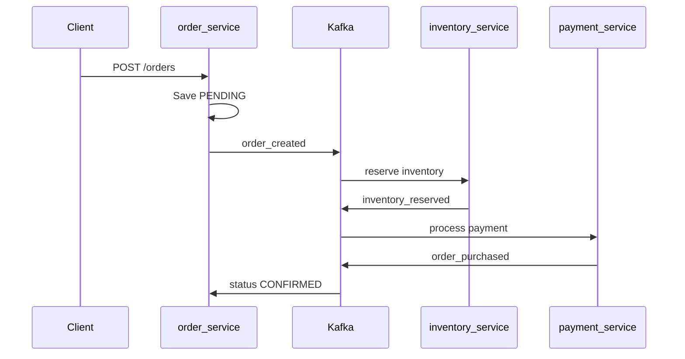
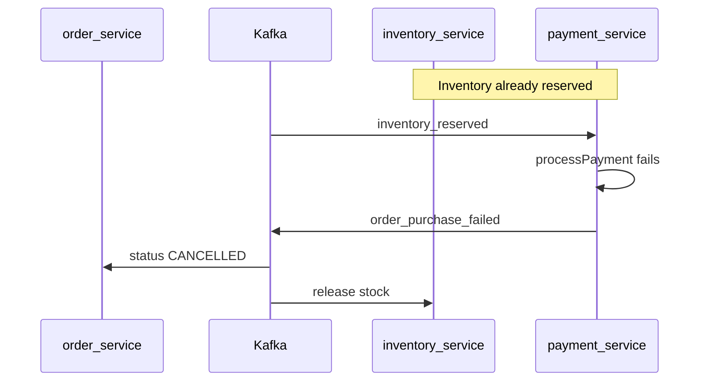

# Ecommerce Microservices

An event-driven ecommerce backend built with four independent Spring Boot microservices — `user-service`, `order-service`, `inventory-service`, and `payment-service`. Services communicate via Kafka using a choreography-based SAGA pattern for order processing. Authentication is handled with JWT, and each service has its own MySQL database.

## Tech Stack

| Layer | Technology |
|-------|------------|
| Language / runtime | Java 21 |
| Framework | Spring Boot 3.5.15 |
| Build | Maven (`./mvnw` per service) |
| Databases | MySQL 8.0 (one DB per service, ports 3308–3311) |
| Migrations | Liquibase |
| Messaging | Apache Kafka (KRaft, port 9092) |
| Caching | Redis (order-service only, port 6380) |
| Inter-service HTTP | OpenFeign + Resilience4j (order → inventory) |
| Security | Spring Security + JWT (`jjwt`) |
| API docs | SpringDoc OpenAPI 2.8.16 |
| Testing | JUnit 5, Mockito, AssertJ, JaCoCo coverage gates |

### Service Ports

| Service | Port | Notes |
|---------|------|-------|
| user-service | 8081 | Auth & user management |
| order-service | 8082 | Order orchestration |
| inventory-service | 8083 | Products & inventory |
| Kafka UI | 8085 | Kafka monitoring |
| payment-service | 8086 | Kafka-only, no REST API |

## How to Setup / Run

### Prerequisites

- Java 21
- Docker
- Maven (or use each service's `./mvnw` wrapper)

### Step 1 — Start Infrastructure

From the repository root:

```bash
docker compose up -d
```

This starts:

- 4 MySQL instances (user, order, inventory, payment)
- Apache Kafka (KRaft single-node)
- Kafka UI at http://localhost:8085
- Redis on port 6380

### Step 2 — Start Services

Start each service in a separate terminal (recommended order):

```bash
cd user-service && ./mvnw spring-boot:run       # 8081
cd inventory-service && ./mvnw spring-boot:run  # 8083
cd payment-service && ./mvnw spring-boot:run    # 8086
cd order-service && ./mvnw spring-boot:run        # 8082
```

### Step 3 — Authenticate API Calls

1. `POST http://localhost:8081/auth/signup` — creates a `USER` account
2. `POST http://localhost:8081/auth/login` — returns a JWT
3. Pass `Authorization: Bearer <token>` to order-service and inventory-service endpoints

### Seeded Admin Account

A default admin user is inserted via Liquibase in user-service:

| Field | Value |
|-------|-------|
| Email | `admin@test.com` |
| Role | `ADMIN` |
| Password | admin123456 |

### First-Time Order Flow

No products are seeded. Log in as admin and create products via `POST /products` on inventory-service before placing orders.

## Swagger Documentation URLs

Swagger is available on the three HTTP services. payment-service has no REST API and no Swagger.

| Service | Swagger UI | OpenAPI JSON |
|---------|-----------|--------------|
| user-service | http://localhost:8081/swagger-ui/index.html | http://localhost:8081/v3/api-docs |
| order-service | http://localhost:8082/swagger-ui/index.html | http://localhost:8082/v3/api-docs |
| inventory-service | http://localhost:8083/swagger-ui/index.html | http://localhost:8083/v3/api-docs |

order-service and inventory-service Swagger configs include a Bearer JWT auth scheme. Use the token from `/auth/login` when testing protected endpoints.

## Roles: ADMIN and USER

Roles are defined in `user-service` and embedded in the JWT `roles` claim (`ROLE_USER` / `ROLE_ADMIN`). Downstream services validate roles via `JwtAuthFilter` and `@PreAuthorize`.

### USER

Assigned automatically on signup.

| Capability | Endpoint |
|------------|----------|
| Sign up / log in | `POST /auth/signup`, `POST /auth/login` |
| Create orders | `POST /orders` |
| View own orders | `GET /orders`, `GET /orders/{id}` |
| Browse products | `GET /products`, `POST /products/bulk-fetch` |

Order queries are scoped to the authenticated user's ID in the service layer — users cannot view other users' orders.

### ADMIN

Seeded via Liquibase; there is no API to promote a user to admin.

Includes all USER capabilities, plus:

| Capability | Endpoint |
|------------|----------|
| Create products | `POST /products` |
| View all orders (system-wide) | `GET /orders/all` |

## SAGA Flow

The order lifecycle uses a **choreography-based SAGA** — services coordinate through Kafka events with no central orchestrator.

### Happy Path



### Kafka Topics

| Topic | Producer | Consumer(s) | Action |
|-------|----------|-------------|--------|
| `order_created` | order-service | inventory-service | Reserve stock |
| `inventory_reserved` | inventory-service | payment-service | Process payment |
| `order_purchased` | payment-service | order-service | Confirm order |
| `inventory_reservation_failed` | inventory-service | order-service | Cancel order |
| `order_purchase_failed` | payment-service | order-service, inventory-service | Cancel order + release stock |

### Order Statuses

| Status | Meaning |
|--------|---------|
| `PENDING` | Order created, saga in progress |
| `CONFIRMED` | Payment succeeded |
| `CANCELLED` | Inventory or payment failure |

### Compensation Paths

**Inventory reservation failure** — stock could not be reserved (e.g. insufficient quantity). Order is marked `CANCELLED`. No inventory was committed, so no release is needed.

**Payment failure** — inventory was already reserved but payment failed. Order is marked `CANCELLED` and inventory is released (stock restored).



### Payment Failure Simulation

`payment-service` intentionally fails payments when the order total **exceeds 200,000**:

- Amount `200000` → succeeds
- Amount `200001` → fails

On failure:

1. A `Payment` record is saved with status `FAILED`
2. `order_purchase_failed` is published to Kafka
3. order-service sets the order to `CANCELLED`
4. inventory-service calls `release()` to restore stock

The HTTP response from `POST /orders` returns `PENDING` immediately. Saga completion is asynchronous — poll `GET /orders/{id}` or monitor events in Kafka UI.

#### Manual Simulation Steps

1. Log in as admin and create a high-price product (e.g. price `100000`)
2. Log in as a user and place an order with quantity ≥ 3 (total > 200000)
3. Poll `GET /orders/{id}` — expect status `CANCELLED`
4. Verify inventory quantity has been restored

## Production Notes

The current setup is intended for local development. Before deploying to production, consider the following:

- **Secrets** — JWT key, database passwords, and Redis password are hardcoded in `application.yaml`. Externalize via environment variables or a secret manager.
- **Service URLs** — All DB, Kafka, Redis, and Feign URLs point to `localhost`. Replace with service DNS names or Kubernetes service endpoints.
- **Spring profiles** — No `application-prod.yaml` exists. Add profile-based configuration for production.
- **Payment simulation** — The `200000` failure threshold in `PaymentServiceImpl` is for development only. Remove or gate behind a profile in production.
- **Kafka** — Single-node Kafka with replication factor 1 is not production-grade. Use a managed Kafka cluster with appropriate replication.

## How to Run Test Cases

Each service is an independent Maven module (no root POM). Run tests from within each service directory:

```bash
# Run unit tests
cd <service-name>
./mvnw test

# Run tests with JaCoCo coverage gate (90% line / 80% branch on order, inventory, payment)
./mvnw verify

# Run a single test class
./mvnw test -Dtest=PaymentServiceImplTest
```

Run tests across all services:

```bash
for svc in user-service order-service inventory-service payment-service; do
  (cd $svc && ./mvnw test)
done
```